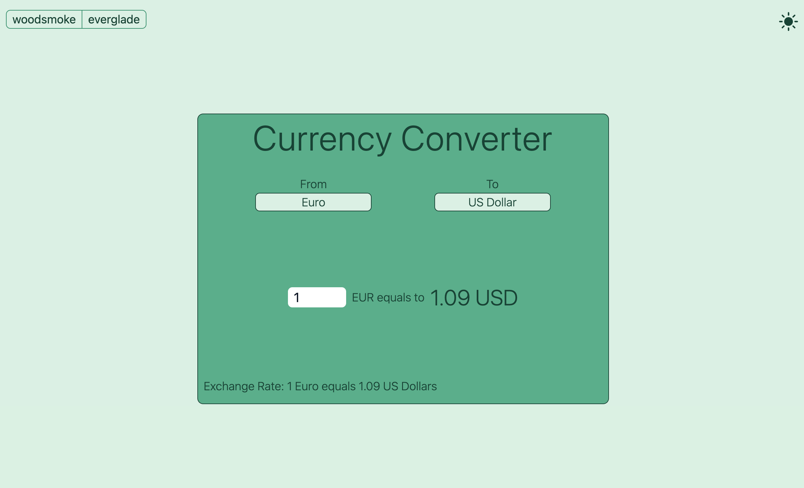

# Currency Converter

A simple currency converter React app built with Vite and [Frankfurter.app](https://www.frankfurter.app/) API.

<div style="display: flex; flex-wrap: wrap; gap: 16px;">
  
  
  
  
</div>

## Overview
## Overview

This web application allows users to convert between different currencies.The core features are pretty straight forward but for the UI i used CSS variables to implement 2 different themes and light-dark mode(not using the native Tailwind's dark variant).


## Features

- Currency conversion
- Two UI themes
- Dark and light mode
- Fully Responsive design
- HeadlessUI components

## Getting Started

### Prerequisites

- Node.js
- npm or yarn

### Installation

1. Clone the repository:

   ```bash
   git clone https://github.com/your-username/currency-converter.git

2. Clone the repository:

   ```bash
   cd currency-converter

3. Install depedencies

   ```bash
    npm install

4. After installing the dependencies, start the application:

   ```bash
    npm run dev
   


